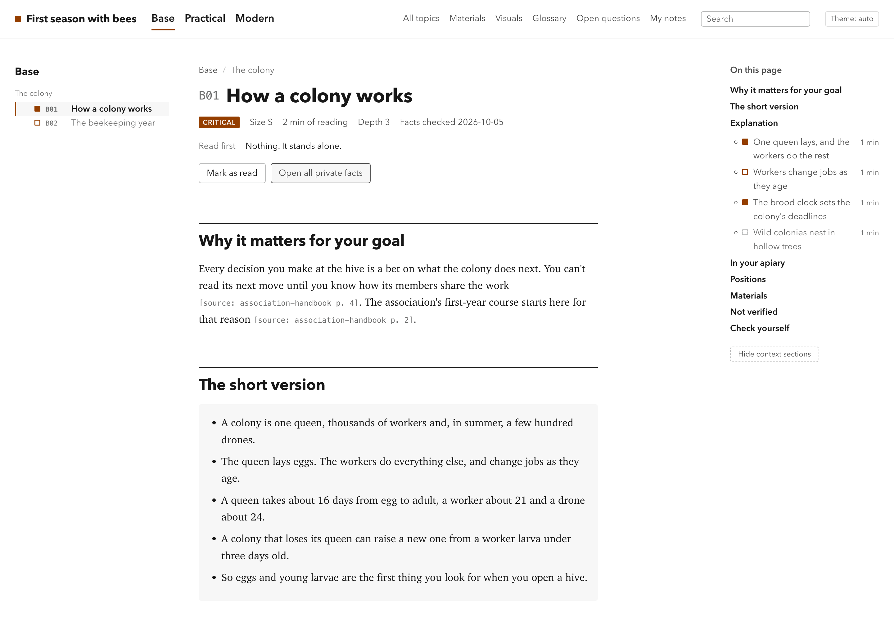
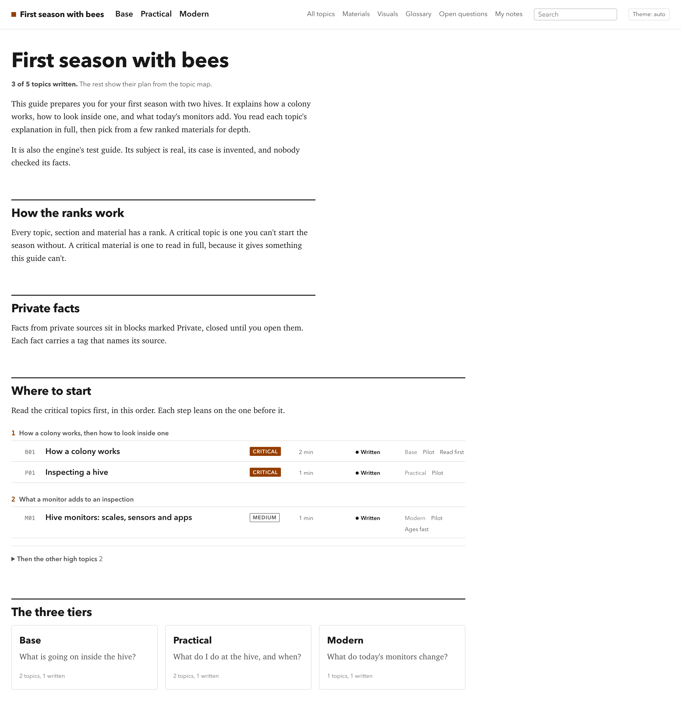
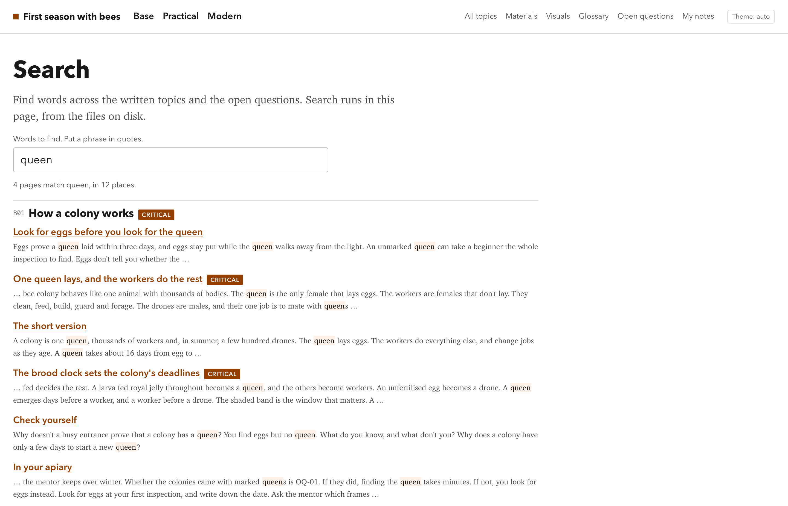
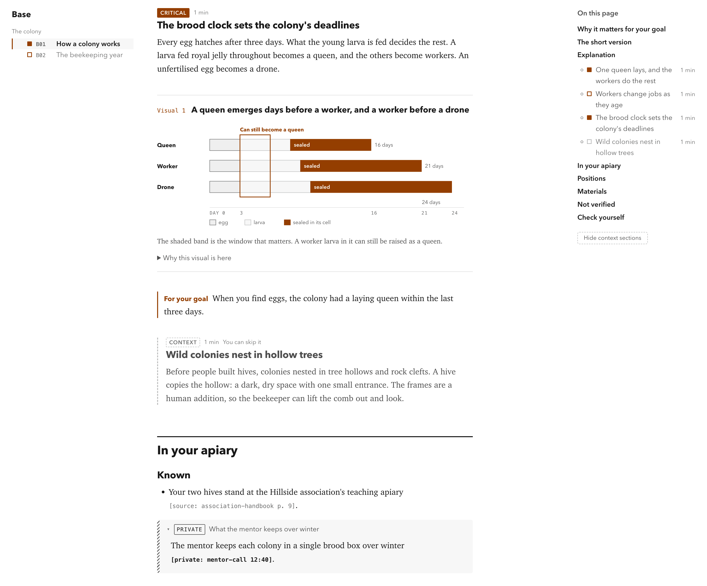
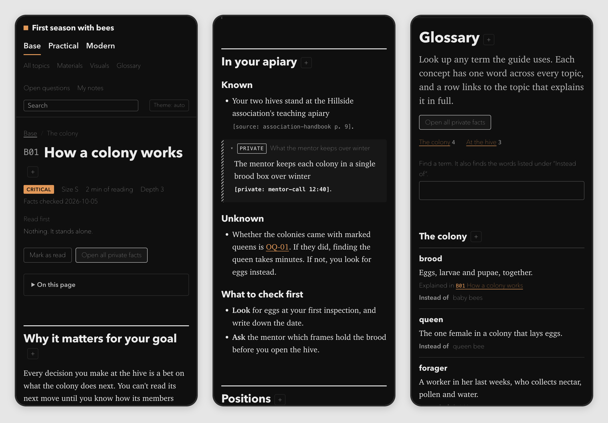

# research-and-learn

You get a guide to a subject you must understand by a date: written for you, ranked by what matters, and readable offline. You build it with your coding agent. It interviews you, researches the subject, proposes a ranked map of topics that fits your hours, then runs subagents that research, write, check and build the guide one topic at a time. You start reading while the rest is still being written.

This is an agentic workspace: a folder you copy and work inside, with any coding agent that reads `AGENTS.md`. There's nothing to install and no server to run.

It was extracted from a 45-topic guide built for one reader on a deadline: about 120,000 words, from the request to 45 topics in the portal in two days of agent sessions. None of that guide's content is in this repository; every file here is written anew for any subject.



## When it fits

Use it when three things hold:

- **You need understanding, not a summary.** You'll have to follow conversations, make decisions and defend them.
- **You have a goal.** You can name what you must be able to do after reading.
- **You have a time budget.** A date, and the hours a day you can read.

It fits best where general knowledge meets a specific situation: a new job in an unfamiliar field, taking over a product or a codebase, an exam, a move to another country. The guide teaches the general subject and keeps what is known about your situation apart, with its sources.

## What you get

### A portal you read offline

You get a static HTML site that opens from disk and works with the network off.

- **Tiers and a reading order.** Topics sit in tiers, such as the basics, the practice and your own case. The home page tells you where to start, critical topics first.
- **A rank and a time on everything.** Every topic, section and material is critical, high, medium or context, with its reading time. You can hide the context sections.
- **Explanations first, materials for depth.** Each topic explains its subject from the ground up, then offers a few ranked materials. A long reading list goes unread, and people read explanations.
- **Private facts in closed blocks.** A fact from a private source stays closed until you open it, and search never shows it.
- **Search** across the topics and the open questions. It runs in the page, from the files on disk.
- **A glossary** with one word per concept, each linked to the topic that explains it.
- **A visual index** of every diagram, with the job it does.
- **The open questions** about your case, with the topics that cite each one.
- **Your notes.** Read marks, bookmarks, notes and to-dos stay in your browser. Download a copy to move them to another browser.
- **A copy to share,** built without the private blocks.
- **Light and dark themes, phone width and print.**

<table>
<tr>
<td width="50%"></td>
<td width="50%"></td>
</tr>
<tr>
<td>The home page gives a reading order, critical topics first.</td>
<td>Search runs in the page and leaves private blocks out.</td>
</tr>
</table>



*A diagram earns its place with a one-sentence job. A context section says you can skip it. A private fact sits in a closed block, shown open here.*



*Dark mode at phone width: a topic, the part about your case, and the glossary.*

The screenshots show the engine's test guide, an invented first season with bees, in `engine/tests/fixture/`.

### Pages built from plain text

- **Topics are plain-text files:** Markdown with a short header, and marked blocks for diagrams and private facts. `engine/format.md` has the format.
- **`guide.toml` holds your settings:** the title, the tiers, the part headings, the size bands, the limits, the provenance tags and the accent colour.
- **`engine/build.py` builds the portal** with Python's standard library alone. Then it runs eight checks, and the build fails if one fails:
  1. Nothing loads from the network.
  2. Every topic appears in its tier, with its rank.
  3. No internal link is broken.
  4. Both themes are defined.
  5. Private facts sit in closed blocks, and search holds none of them.
  6. The home page's totals match the pages.
  7. The glossary is complete and shows no private source.
  8. The visual index lists every diagram once.
- **A guard runs last.** Nothing on your never-publish list may appear anywhere in the site.

### Rules your agent works to

| Part | What it gives your agent |
| --- | --- |
| Skills, in `.agents/skills/` | The set-up interview, the scaffold that proposes the topic map, and a pass that removes AI-sounding prose |
| The playbook | The phases, two ways to run workers, which model does which job, and a cost log against your budget |
| Briefs | A template for each kind of worker, with a filled example of each. Every worker ends with a handoff |
| Standards | Rules for a topic page, for sources, visuals, writing and the portal |
| The format check | Every topic has its parts, ranks and tags, before it reaches the build |
| The lint | The writing rules: banned glossary words, untagged claims about your case, dashes, filler and more |
| The guard | Your never-publish list fails the lint and the build. A private-term scan checks a copy before you share it |

## How a guide gets built

| Phase | What happens | What you do |
| --- | --- | --- |
| Set-up | The agent interviews you: the reader, the goal, the date and hours, the subject, your situation, your sources | Answer, and drop your sources into `context/sources/` |
| Scaffold | The agent researches your situation and proposes a topic map that fits your hours | Nothing |
| Kickoff | The agent shows its assumptions and the map | Confirm or change them |
| Pilot | One topic per tier, written, checked and built | Read them. Say what to change |
| Waves | Critical topics first, then high, then medium. The portal rebuilds as each finishes | Start reading. Stop the build when you have enough |
| Integration | Tier maps, the home page, the glossary, the open questions, checks across the guide | Nothing |
| Reading | You read, mark and take notes. Fixes go out in batches | Read |

You're needed three times: the set-up interview, the kickoff and the pilot. The pilot comes before the fan-out because your taste in depth, length and visuals shows only when you see a page. In the source build, all three pilot writers filled their size band to the ceiling, and the reader cut the bands after reading them.

## What it costs

Tokens, mostly. In the source build, a topic cost about 320,000 to 400,000 tokens to reach the portal with a batch facts check, and about 480,000 to 650,000 with an independent review. At that rate, a 15-topic guide costs about 5 to 6 million tokens, before the scaffold and integration. The orchestrator logs each run's cost against its projection, so the plan changes before the budget runs out.

## Start

You need a coding agent that reads `AGENTS.md`, runs commands and reaches the web, and Python 3.11 or later. Nothing else installs. The workspace was built and tested with [Claude Code](https://claude.com/claude-code).

```bash
git clone https://github.com/batirko/research-and-learn.git my-guide
```

Open the folder in your agent and say what you need to learn, and by when. The set-up skill takes it from there.

The skills live in `.agents/skills/`, where most agents look, and `.claude/skills` links there for Claude Code. On Windows, git checks the link out as a plain file unless symlinks are on. To use Claude Code there, copy `.agents/skills` to `.claude/skills`.

To build the portal at any point, run this from the folder, then open `site/index.html`:

```bash
python3 engine/build.py
```

If your `python3` is older than 3.11, call `python3.11` instead.

## What's inside

| Path | What it holds |
| --- | --- |
| `AGENTS.md` | The operating guide for any agent working in the folder |
| `guide.toml` | Your guide's settings: title, tiers, part headings, sizes, limits, tags, accent colour |
| `docs/` | The method on one page, the standards, your request and the decision log |
| `context/` | What is known about you, your goal and your situation, with your frozen sources |
| `curriculum/topic-map.md` | What gets built and why |
| `orchestration/` | The orchestrator's playbook, the worker briefs, the board and the handoffs |
| `content/` | The topics, by tier |
| `engine/` | The build, its eight checks, the format check, the styles and the scripts |
| `tools/` | The lint and the private-term scan |
| `.agents/skills/` | Set-up, scaffold, and a pass that removes AI-sounding prose. `.claude/skills` links here |

Everything under `context/`, `curriculum/`, `content/` and `orchestration/` starts as a template with instructions. The set-up and the scaffold fill them, and your copy becomes your project. To upgrade, copy `engine/` and `tools/` from a newer release: nothing you write lives there. If a portal worker changed the engine for your guide, the decision log says what, so the change can be made again after the upgrade.

## The parts worth taking even if you build guides another way

**The explanation carries the knowledge.** Materials are for depth, and a long list is a failure of selection. Critical materials are capped per topic and per guide, and each says what it gives that the guide can't.

**Rank everything.** Topics, sections and materials share one four-level scale. A reader who knows a section is context can skip it without guilt.

**Evidence and interpretation stay apart.** Every fact about your situation carries a tag that says where it came from. An unknown becomes an open question with its likely answers, never a guess written as fact.

**A visual earns its place.** It needs a one-sentence job, written before drawing, and a subject with a shape. Most topics have none.

**One word and one home per concept.** The glossary bans the synonyms, and the topic map names the one topic that explains each shared idea.

**The pilot before the fan-out.** Three topics, read by you, before forty more get written to the wrong length.

## Before you share a portal

A built portal holds the text of every private block, closed but present. To send it to anyone, build a copy without them, then scan that copy against a list of the names and phrases that must not leave your machine:

```bash
python3 engine/build.py --share
```

```bash
python3 tools/scan.py files site-share/ --terms ~/path/to/your-private-terms.txt
```

The list lives outside the folder, so the list itself never gets shared. `engine/core/terms.py` describes its format.

## Credits

The slop pass in `.agents/skills/no-ai-slop/` is [no-ai-slop](https://github.com/petergyang/no-ai-slop) by Peter Yang, under the MIT licence.

## Licence

[MIT](LICENSE).
